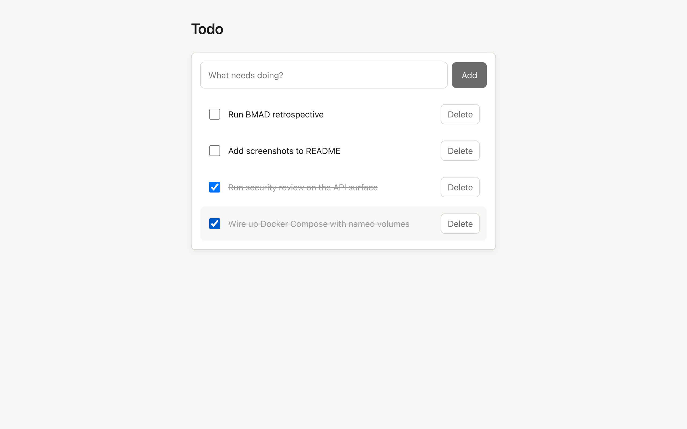
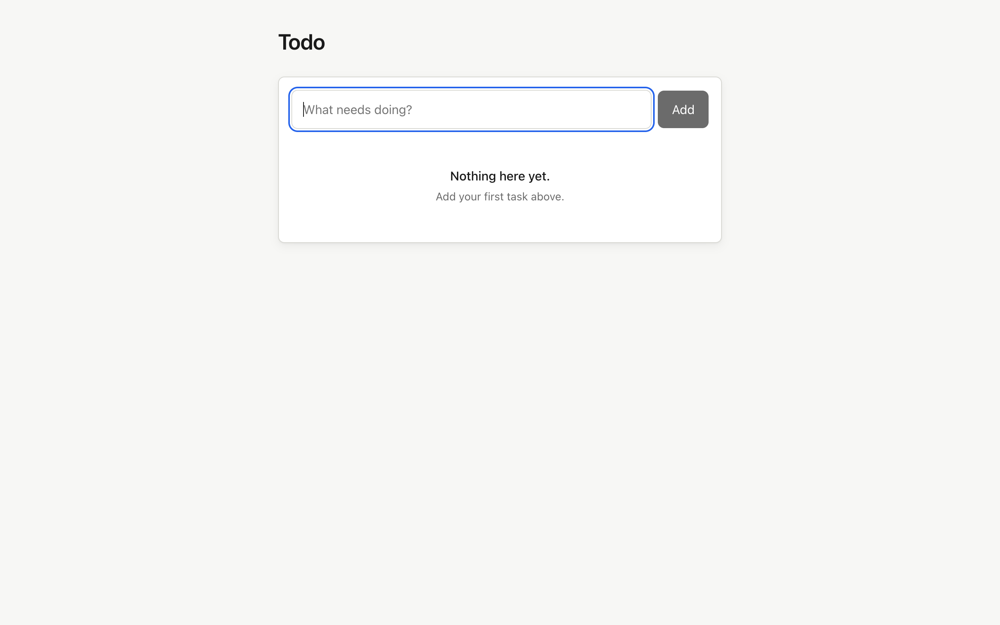
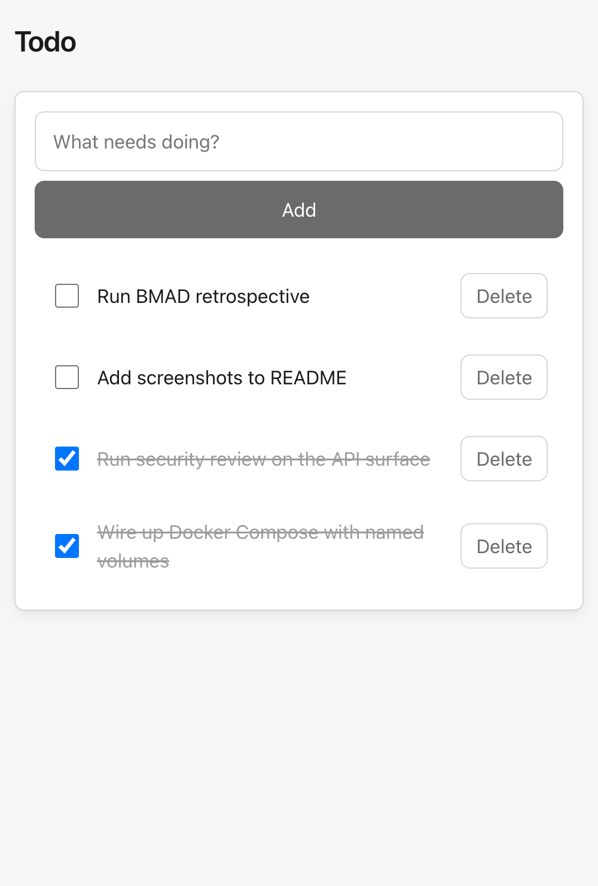

# bmad-todo-app

A single-user, full-stack Todo app — React 19 SPA, Fastify API, PostgreSQL — built end-to-end by AI agents driven by [BMAD](https://github.com/bmadcode/bmad-method).

The product surface is intentionally small (list / add / toggle / delete). The repo's interest is in *how* it was built: PRD → architecture → epics → stories → code → containers → QA, with each phase produced by a different BMAD agent persona and the trail captured in `docs/ai-integration-log.md`.



<details>
<summary>More views — empty state and mobile</summary>

| Empty state | Mobile (390 × 740) |
|---|---|
|  |  |

</details>

---

## Quick start

Requires Docker (29+) and Docker Compose v2.

```bash
cp .env.example .env       # then edit POSTGRES_PASSWORD — the example ships a placeholder
docker compose up --build
```

Open <http://localhost:8080>. The browser only ever talks to the `web` container; nginx reverse-proxies `/api/*` to the `api` service on the internal network.

By default the published port is bound to `127.0.0.1` only — the dev stack is not reachable from your LAN. To expose it (e.g. testing from another device), set `BIND_HOST=0.0.0.0` before `compose up`. Same applies to the api port published by the dev overlay.

Tear down (preserve data):

```bash
docker compose down
```

Tear down and wipe data:

```bash
docker compose down -v
```

---

## Local development (without Docker)

Requires Node 24+ and a Postgres instance reachable from your machine.

```bash
npm install
cp .env.example .env       # adjust DATABASE_URL if needed
npm run -w @bmad-todo/api db:migrate
npm run -w @bmad-todo/api dev      # api on :3000
npm run -w @bmad-todo/web dev      # SPA on :5173
```

The Vite dev server reads `VITE_API_BASE_URL=http://localhost:3000` so the SPA hits the api directly. `CORS_ORIGIN` is a comma-separated allowlist; the example covers `:8080` (prod nginx) and `:5173` (vite local). If you access the dev SPA from another device via the LAN URL vite prints, add that origin to the list and restart the api.

### Hot-reload via Compose

If you'd rather develop inside containers (matching the prod toolchain) but with hot reload:

```bash
docker compose -f docker-compose.yml -f docker-compose.dev.yml up
```

Source is bind-mounted; `tsx watch` and `vite` pick up changes.

---

## Testing

| Command | What it runs |
|---|---|
| `npm run lint` | ESLint across all workspaces |
| `npm run typecheck` | `tsc --noEmit` per workspace |
| `npm test` | Vitest unit + integration (api uses Testcontainers — needs Docker) |
| `npm run test:coverage` | Same with v8 coverage; thresholds gated at 70% line/branch/function/statement |
| `npm run test:e2e` | Playwright against `npm run dev` (auto-spawns api + web) |

### E2E against the containerized stack

```bash
mkdir -p packages/web/test-results packages/web/playwright-report
docker compose -f docker-compose.yml -f docker-compose.test.yml \
  up --build --abort-on-container-exit --exit-code-from e2e
```

Why those flags matter:

- `--abort-on-container-exit` tears the whole stack down the moment any service exits, so the run doesn't hang after Playwright finishes.
- `--exit-code-from e2e` makes Compose return the `e2e` container's exit code as its own. Without it, a failed test suite still produces a successful `compose up`, which is silently wrong in CI.
- `mkdir -p ...` ahead of time means Docker doesn't create the bind-mount targets root-owned (which makes them painful to clean up afterwards).

Reports land in `packages/web/playwright-report/` and `packages/web/test-results/`.

### Persistence check

```bash
POSTGRES_PASSWORD=testpw bash scripts/test-persistence.sh
```

Brings the stack up, creates a marker todo, runs `compose down`, brings it back up, and asserts the marker survived. Verifies the named `db_data` volume actually persists data.

---

## Architecture in one paragraph

Three services orchestrated by Compose: `db` (Postgres 16, named volume), `api` (Fastify 5 on Node 24, Drizzle ORM, runs migrations on startup), and `web` (Vite-built React 19 served by nginx). Only `web` is exposed to the host. The api validates requests with Zod schemas shared with the SPA (`packages/shared`), returns errors as `{ error, message, code }`, logs structured JSON via pino with a request id, and reports liveness on `/healthz`. Optimistic UI runs through TanStack Query mutations.

Detailed design (diagrams, ERD, OpenAPI contract, ADRs): [`_bmad-output/planning-artifacts/architecture.md`](./_bmad-output/planning-artifacts/architecture.md).

---

## Repository layout

```
packages/
├── shared/   Zod schemas + TS types shared between api and web
├── api/      Fastify backend, Drizzle migrations, integration tests
└── web/      React 19 SPA, vitest unit tests, Playwright e2e + a11y
docker-compose.yml          # prod-like: db + api + web, only web exposed
docker-compose.dev.yml      # overlay: hot reload, source bind-mounts
docker-compose.test.yml     # overlay: Playwright runner against the stack
scripts/test-persistence.sh # asserts data survives down/up
docs/
└── ai-integration-log.md   # per-agent prompts, what worked, where humans were load-bearing
_bmad-output/
└── planning-artifacts/     # PRD, architecture, epics, stories
```

---

## Environment variables

See [`.env.example`](./.env.example). Compose reads `.env` from the project root automatically.

| Var | Service | Required | Default | Purpose |
|---|---|---|---|---|
| `DATABASE_URL` | api | yes | — | Postgres connection string. **In Compose this is constructed automatically from `POSTGRES_USER`/`POSTGRES_PASSWORD`/`POSTGRES_DB`** — you don't set it directly. Set it manually only when running the api outside Compose. |
| `PORT` | api | no | `3000` | api listen port |
| `LOG_LEVEL` | api | no | `info` | pino level |
| `CORS_ORIGIN` | api | no | `http://localhost:8080` | comma-separated allowlist of origins (e.g. `http://localhost:8080,http://localhost:5173`) |
| `NODE_ENV` | api | no | `development` | `production` in built image |
| `VITE_API_BASE_URL` | web (build-time) | yes | `/api` (Compose) | base URL the SPA hits |
| `POSTGRES_DB` | db | yes | `todos` | |
| `POSTGRES_USER` | db | yes | `todos` | |
| `POSTGRES_PASSWORD` | db | yes | — | gitignored via `.env` |
| `WEB_PORT` | compose | no | `8080` | host port mapped to nginx |
| `API_PORT` | compose (dev overlay) | no | `3000` | host port mapped to api in the dev overlay |
| `BIND_HOST` | compose | no | `127.0.0.1` | host interface to bind published ports to. Set to `0.0.0.0` to expose on the LAN |

### Migrations run on every `up`

`packages/api/src/server.ts` calls `runMigrations()` before `app.listen()` (architecture ADR-5), so every `docker compose up` brings the schema to the latest version. Drizzle migrations are idempotent — applying them against an already-migrated database is a no-op. Worth knowing in two cases: (a) when pointing the api at a database it doesn't own, and (b) when investigating a slow first-request after a fresh `up`.

---

## Security posture

Hardening applied in commit `a0421ef` (E5-S4): bounded `/todos` pagination, sanitized validation errors, server-only request IDs, postgres pool timeouts, advisory-lock-protected migrations, postgres URL redaction in startup logs, HSTS + tightened CSP at nginx, dotfile/source-map deny rules, `/api/healthz` locked to in-container loopback, method allow-list, X-Forwarded-For overwrite, fail-fast on missing `VITE_API_BASE_URL` in production builds, localhost-only port bindings by default. Full review and triage in [`docs/qa/security.md`](./docs/qa/security.md); accepted-and-deferred items in [`_bmad-output/implementation-artifacts/deferred-work.md`](./_bmad-output/implementation-artifacts/deferred-work.md).

Out of scope for v1 per NFR-11 and explicitly flagged: authentication, authorization, CSRF, multi-tenant isolation. Revisit on the first shared/internet-reachable deployment.

---

## AI integration

The repo is the artifact of an experiment in agent-driven delivery. Each BMAD persona — Analyst, PM, Architect, SM, Dev, QA — was invoked in turn; the prompts, what each agent did well, where it stalled, and where human judgment had to step in are recorded in [`docs/ai-integration-log.md`](./docs/ai-integration-log.md). Read that file alongside the architecture document to see the relationship between intent, plan, and code.
